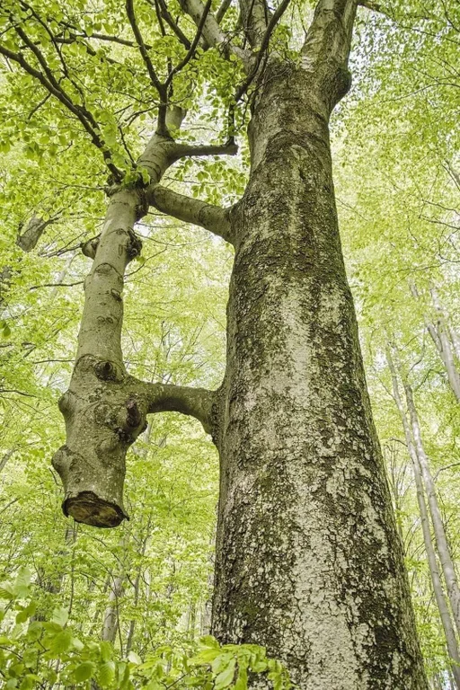

= Inosculation

When branches or roots of different trees are in prolonged intimate contact, they often abrade each other, exposing their inner tissues, which may eventually fuse. 

It's not so much one tree feeding another as the formation of a new hybrid organism.

